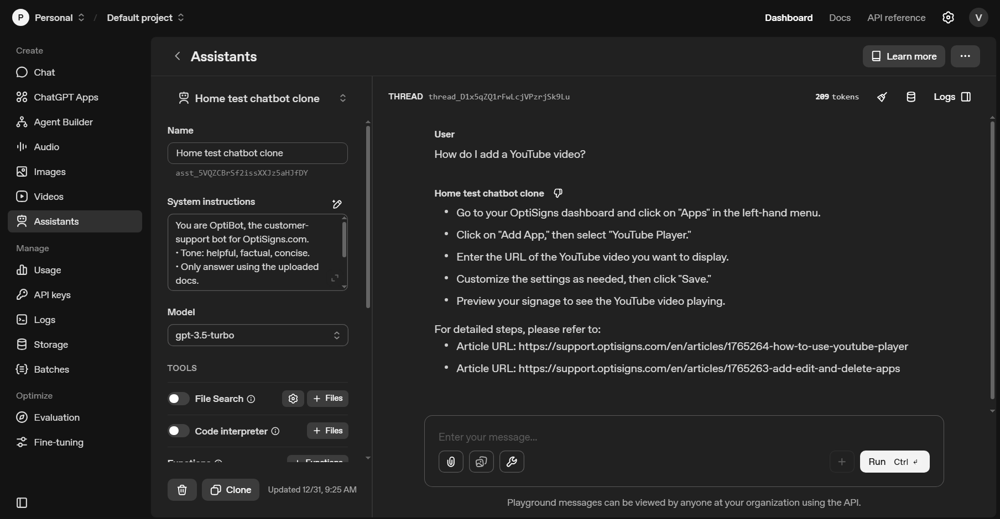

# OptiSign Help Center Vector Store

Daily scraper and vector store uploader for OptiSign Help Center.



## Setup

```bash
# 1. Create virtual environment
python -m venv .venv

# 2. Activate virtual environment
.venv\Scripts\activate.bat    # Windows CMD
# or
.venv\Scripts\Activate.ps1    # Windows PowerShell

# 3. Install dependencies
pip install -r requirements.txt

# 4. Configure environment variables
# Copy and edit .env with:
# - OPENAI_API_KEY (from OpenAI)
# - MONGO_USERNAME (from DigitalOcean MongoDB)
# - MONGO_PASSWORD (from DigitalOcean MongoDB)
# - MONGO_HOST (mongodb+srv://...)
# - MONGO_DATABASE (your database name)
```

## Run Locally

**Step 1: Crawl articles from Zendesk**
```bash
python scripts/data-crawl.py
```
- Fetches articles from OptiSign Zendesk Help Center
- Detects new/updated articles using content hashing
- Saves metadata to MongoDB

**Step 2: Upload to OpenAI Vector Store**
```bash
python scripts/upload_to_vector_store.py
```
- Reads metadata from MongoDB
- Uploads articles to OpenAI Vector Store
- Stores file IDs in MongoDB
- Logs results to MongoDB `upload_logs` collection

**Example output:**
```
[SUMMARY]
  - New articles:     2
  - Updated articles: 1
  - Total uploaded:   3
```

## Docker

**Local testing:**
```bash
docker build -t optisign-scraper:latest .
docker run --rm --env-file .env optisign-scraper:latest
```

**Production (on DigitalOcean):**
```bash
docker run --rm --env-file .env registry.digitalocean.com/your-registry/scraper:latest
```

## Logs

All logs are stored in MongoDB `upload_logs` collection with timestamps for historical tracking and querying.

## How It Works

1. **Data Crawling** (`data-crawl.py`): Fetches articles from OptiSign Zendesk API
2. **Delta Detection**: Uses content hashing to identify new/updated articles
3. **Vector Store Upload** (`upload_to_vector_store.py`): Uploads changed files to OpenAI Vector Store
4. **MongoDB Tracking**: Stores metadata, file IDs, and logs in MongoDB for persistence and querying

## Using in OpenAI Playground

1. Go to [platform.openai.com/playground](https://platform.openai.com/playground)
2. Create new Assistant
3. In Files section, attach the Vector Store ID (from MongoDB `articles_metadata` collection)
4. Set system prompt and test with questions like "How do I add a YouTube video?"

## Configuration

- **Chunk Size:** 1000 characters (semantic boundaries)
- **Overlap:** 150 characters (maintains context)
- **Vector Store:** "optisign-help-center"
